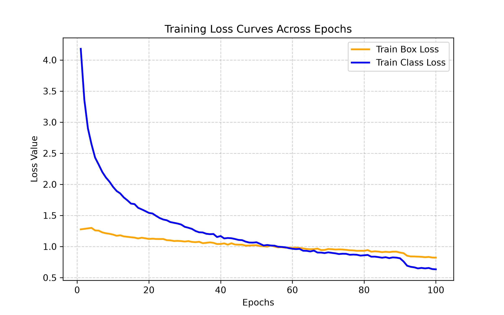
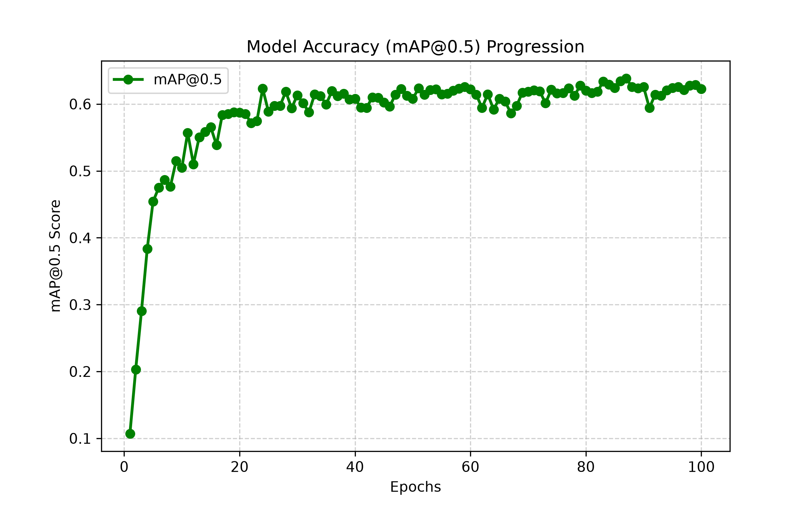
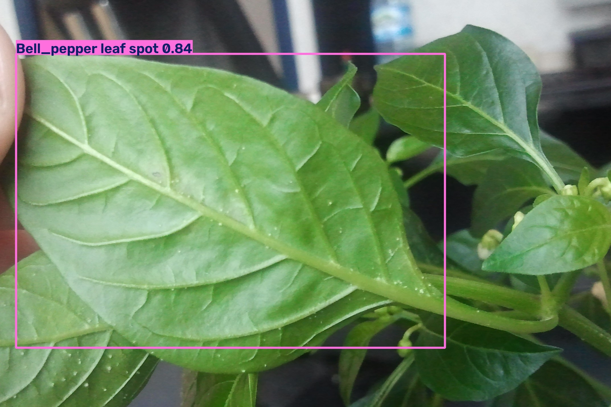

# AgriVision: End-to-End Plant Pathology & Crop Disease Detection System

An enterprise-grade computer vision pipeline built with **Ultralytics YOLOv8**, engineered for real-time plant disease detection and localized pathology tracking across 29 distinct agricultural classes.


## Project Overview & Background

AgriVision was built to bridge state-of-the-art computer vision models with real-world, consumer-grade hardware constraints. Trained on 2,335 curated field images, the model localizes and identifies fine-grained foliar conditions—ranging from healthy crop foliage to severe infections like *Corn leaf blight*, *Tomato late blight*, and *Apple Scab Leaf*.

Building this pipeline on a local Windows machine required solving several systems-level engineering challenges:
 **RAM Caching (`cache=True`):** Pre-loads the entire dataset directly into system memory during initialization to entirely eliminate disk read latency during training.
 **Automatic Mixed Precision (`amp=True`):** Leverages NVIDIA Tensor Core hardware acceleration to speed up convergence while maintaining numerical stability.
 **Windows Process Isolation Handling:** Bypasses Windows `multiprocessing.spawn` pickling collisions and broken pipe errors by enforcing a single-process data feeding mechanism (`workers=0`).


## Model Performance & Evaluation Metrics

Quantitative performance achieved following the 100-epoch training cycle:

| Metric | Score | Interpretation |
| :---   |  :--- | :--- |         
|1.  **mAP@0.5** | `0.4931` | High-level detection accuracy measured at a standard 50% Intersection over Union (IoU) threshold. |
|2.  **mAP@0.5:0.95** | `0.6283` | A rigorous composite metric averaging precision across stricter overlap thresholds from 50% to 95%. |

### Training Progression & Accuracy Curves
The graphs below illustrate smooth loss decay and consistent accuracy gains across the training cycle:
1.  **Loss Convergence:** 

2.  **mAP Progression:** 


---

## Sample Inference Output

Real-time bounding box localization and multi-class classification tested against validation samples. Predictions are filtered using a strict confidence threshold (`conf=0.5`) to eliminate background noise and false positives:



---

## Hardware Infrastructure & Specs

1. **GPU:** NVIDIA GeForce RTX 4050 Laptop GPU (6GB VRAM) running CUDA 12.6 for accelerated tensor operations.
2. **CPU:** Intel Multi-Core Architecture handling system orchestration and single-process data loading.
3. **RAM:** High-capacity system memory dedicated to dataset RAM caching.
4. **OS:** Microsoft Windows (x64) utilizing custom execution guards.

---

## Tech Stack & Libraries

1.  **Core Framework:** Ultralytics YOLOv8 (`ultralytics`)
2.  **Deep Learning Backend:** PyTorch (`torch`, `torchvision` with CUDA support)
3.  **Image Processing:** OpenCV (`cv2`)
4.  **Logging & Visualization:** Pandas (`pandas`), Matplotlib (`matplotlib`)

---

## Quick Start Guide

1. Clone the repository:
   ```bash
   git clone [https://github.com/AbdulWahid-1/AgriVision_Crop_Disease_CNN.git](https://github.com/AbdulWahid-1/AgriVision_Crop_Disease_CNN.git)
   cd AgriVision_Crop_Disease_CNN